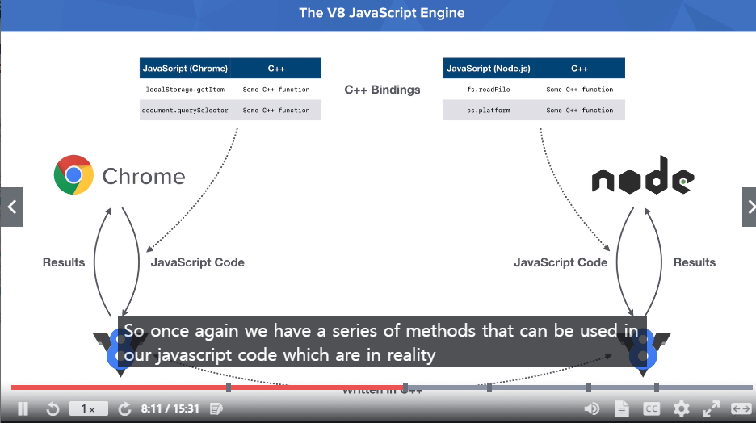

# 1주차
## Section 2. Installing and Exploring Node.js

### 1. My first Node.js Script
	
   a. 'App.js' Script 만들기
		
```javascript
console.log( ‘Hello Node.js!’)
```


 b.Script 실행하기

 
 	$ node app.js 

 result) Hello Node js!
 
 ### 2. Node.js는 무엇인가
  + Nodjs 는 **프로그래밍 언어가 아니다.**
  + javaScript Runtime 으로 , 핵심 자바스크립트 언어이지만 사용자 정의 function과 object들이 포함된 것으로 , 개발자가 필요로 하는 다양한 tool을 제공.
  <br>
  </img>
  + chrome과 Node는 V8 으로 js 코드를 전달하여 결과 반환.
  + V8은 C++로 작성되었으며 크롬과 노드 또한 대부분 C++로 작성.
   > -> 크롬과 노드 모두 C++를 많이 사용하는 이유는 V8 엔진을 인스턴스화할 때 둘 다 바인딩을 제공하기 때문입니다.
   > 단순히 자바스크립트 코드를 V8에 전달하는 것이 아니라, 이러한 C++ 바인딩을 전달하여 자바스크립트 코드를 실행해야 하는 컨텍스트를 만드는 것.
  + Chrome은 javascript에 포함되지 않은 DOM과도 interact 가능
  + node는 javascript에 포함되지 않은 file system과도 interact 가능
  + 두 함수 모두 자바스크립트 프로그래밍 언어의 일부가 아님.
  +  그것들은 실제로 크롬 or node.js 런타임에 의해 구현되기 때문입니다.
 
## Section 3. Node.js Module System
>1.Importing core modules

```javascript	
const fs = require('fs') // ‘fs’ module 로드하기
fs.writeFileSync('notes.txt', 'I live in Philadelphia') // ‘notes’텍스트에 string 작성
```
>2. Importing your own file

-app.js
 
    
    const notes=require('./notes.js') *//notes .js 파일 실행*
	const string=notes()
	console.log(string)
    
-notes.js 
	
```javascript
	const getNotes = function(){
    	const str="Your notes..."
    	return str;
	}
	module.exports=getNotes  //getNotes 함수를 script사이에서 공유가능하도록 함.
```

 >3.Importing npm Modules

+ Step 1) initialize npm – npm init (from the root of the project)
	- npm init -y : 모든 항목을 default 설정 후 package.json file 생성
+ Step 2) npm install validator@10.8.0 ( npm모듈명@version)
+ validator 사용예제
		
```javascript
const validator =require('validator')
console.log(validator.isURL('https://www.udemy.com'))
```
 

+ npm module 관련 method & searching 참고 : www.npmjs.com


>4.Install npm module globally & Using nodemon

+ global 로 설치할 경우, 개별 project folder이 아닌 OS itself에 설치됨.
+ npm install nodemon@2.0.6 -g
+ nodemon은 terminal에서 node를 반복적 실행 할 필요 없이 파일의 코드가 변경될 때마다 자동으로 실행됨.
+ 종료는 Ctrl+c


	


	
