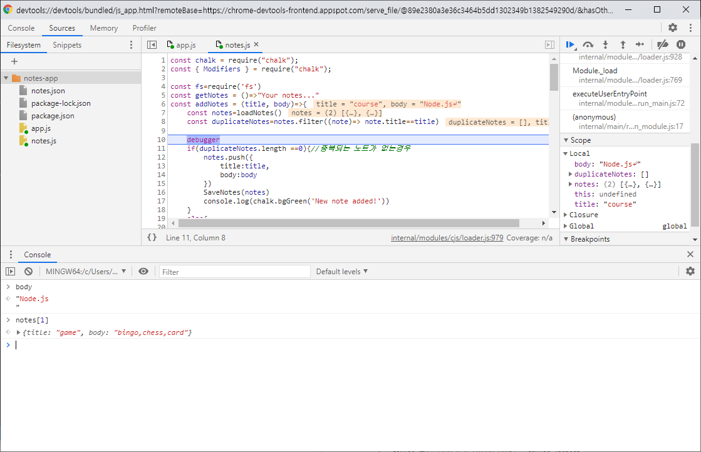
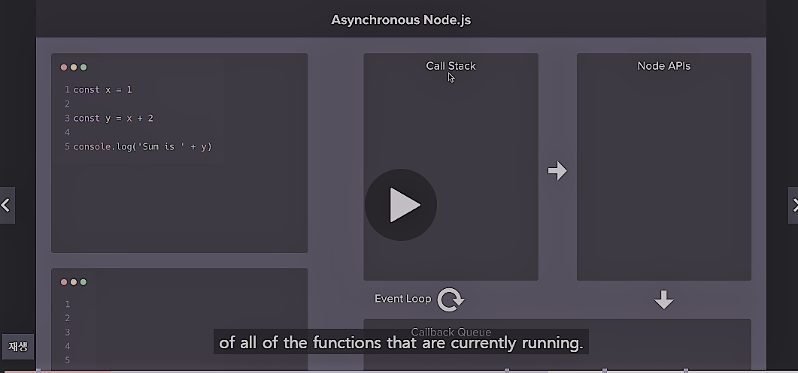

# Week2
## Section 4. File System and Cmd Line Args


### 1. Getting input from user (using command line argument)


-실행파일 : app.js

```javascript
console.log( process.argv )
```

   

 -console
	
    $ node app.js Yoonjin
  result)
  
[ 'C:\\Program Files\\nodejs\\node.exe',     *//argv[0]*
 
 'C:\\Users\\yoonjin\\Desktop\\web\\notes-app\\app.js',   *//argv[1]*
  
 'Yoonjin'	*//argv[2]*
 ]   


 
### 2. Using  *yargs*  npm module
```javascript
yargs.command({
    command:'add',
    describe:'Add a new note',
    builder:{
        title:{
            describe:"Note title",//description
            demandOption:true, //must provide 'title', default = false
            type:'string' //set the type of title
        },
        body:{
            describe:"main script of the note",
            type:'string'
        }
    },
    handler:function(argv){
        console.log('Adding a new note!\nTitle:',argv.title)
        console.log('contents:\n',argv.body)
    }
})
yargs.parse()
```
+ 틀린 예시
		
		$ node app.js add
	result) (error) 필수 인자를 받지 못했습니다: title -->demandOption : true이기 때문
+ 옳은 예시

		$ node app.js add --title="Shopping List" --body="Milk,Yogurt,Cheese"

	result)
   		>Adding a new note!   
		>Title: Shopping List   
		>contents: Milk,Yogurt,Cheese

### 3. Storing Data using JSON
- JSON : attribuite - value 쌍으로 이루어진 데이터 오브젝트를 전달하기 위한 개방형 표준 포맷
- Javascript value 를 JSON string으로 변환 후, 파일에 write 한다.
- JSON string을 Javascript value로 변환하여 읽어올 수 있다.
```javascript
//1.Load and parse the JSON data
const myinfo=fs.readFileSync('1-jon.json')
const myinfoObj=JSON.parse(myinfo.toString()) // Json string to object
//2.Change the name and age property using my info
myinfoObj.name='yoonjin'
myinfoObj.age=25
console.log(myinfoObj)
 
//3. Stringify the changed object and overwrite original data
fs.writeFileSync('1-jon.json',JSON.stringify(myinfoObj)) object to JSON string
```
### 4. Arrow functions
```javascript
    //일반적인 함수 형태
    const square =function(x){
		return x*x
    }
    
    //Arrow function type 1
    const square = (x) =>{
    	return x*x
    }

    //Arrow function wiht shorthand syntax
    const square = (x) => x*x
```
+ Arrow function
	- this 바인딩 하지 않는다.
	- object의 method로 사용하지 않음.
	
+ Method 로는 ES6에서 제공하는 간단한 함수의 형태를 사용한다

  ```javascript
  	//example
    const event ={
    	printGuestList(){
     	//body
     	}
    }
    ```
## Section 5. Debugging Node.js
1. console. log 사용하기
  - 너무 많은 variable 출력하여 확인하기 힘들다
    
2. Node debugger 사용
    
 - built-in tool
 - V8 & 크롬 브라우저와 통합 
 - application을 중단 후 모든 것을 볼 수 있다.
 - 사용 방법
   1. 코드에 debugger 추가
   2. node inspect app.js add -- title='course' --body='Node.js'
   3. chrome 통해 chrome://inspect 접속
   4.  device 등록 (127.0.0.1:9229 입력) - device inspect
   5.  </img>

## Section 6. Asynchronous Node.js

### 1.Asynchronous(비동기) basics

  + 동기(Syncronous) 와 비동기(Asynchronous)
   	- 동기 : 결과가 주어질 때까지 아무것도 못하고 대기
   	- 비동기 : 결과가 주어지는데 걸리는 시간동안 다른 작업 수행 가능
   
+ 예시
	-  code
      ```javascript
      console.log('Starting')

      setTimeout(()=>{
          console.log('2 second timer')
      },2000) // run some code after a specific time passed ( fuction, millsecond)


    	console.log('Stopping')```
 	(result)   
 	>Starting     
 	Stopping    
	2 second timer
  		
  - Synchronous model : 2second를 기다린 후 program 재진행
  - Asynchronous non blocking model : 2초간 다른 코드를 실행할 수 있음.
- 한 사용자의 데이터를 가져오는 data request의 경우, 동시에 다른 일을 수행할 수 있으므로 그러한 경우에 유용.
 
### 2.Call stack, Callback Queue, Event loop
1. 예시
	+ code
		```javascript
		console.log('Starting')

		setTimeout(()=>{
   			console.log('2 second timer')
		},2000) // run some code afte a specific time passed ( fuction, millsecond)

		setTimeout(()=>{
    		console.log('0 second timer')
		},0)

		console.log('Stopping')
		```
	+ result)   
		>Starting     
 		Stopping  
        0 second timer   
		2 second time
        <br>
        
       </img>
  2. Call stack
	  + V8과 javaScript engine에 의해 제공되는 간단한 데이터 structure.
	  + 실행되고 있는 모든 함수들을 지속적으로 관리
	  + Last In First Out 의 Stack 형태
  
  3. Node APIS
	  + **setTimeout** 은 javscript definition 도 아니고 v8에 속하는 것도 아닌, Nodejs에서 제공하는 c++을 사용하여 구현된 function.
	  + **setTimeout()**  호출 시, node API에 등록되어 (위 얘제에서는) 2초간 대기.
	  + 그 동안, Call Stack에서는 다른 함수 수행 가능.    
	  + java script는 single threaded progmming language.
	  + 실행코드는 single threaded 이지만, node는 event를 처리하기 위해 뒤에서 C++ 활용하는 다른 thread를 사용하는 것. -> non blocking nature of node.js
	 + **setTimeout(func(),0)** 또한 node API에 등록된 후 0초 대기 
  4. callback queue
	 + event가 끝이 나면, **setTimeout(func(),0)** 은 Callback Queue 에 추가
  5. Eventloop
	 + Eventloop는 call stack이 empty 상태가 될 때까지 대기
	 + synchrnoous: main함수가 끝이나면 application ends.
	 + Asynchrnous: main이 끝이나도 eventloop는 일을 시작.
	 + Call stack empty를 확인 후, call back Queue 로부터 call stack으로 item을 불러 온 후 실행.


### 3. Making Http Request
	
+ http request 가 중요한 이유 : 다른 서버와의 소통에 사용 되는 핵심.

+ (예시) location에 대한 정보를 통해 그 지역에 대한 weather 정보 불러오기
	
	1. npm init 
    2. npm install postman-request -. 필요모듈 설치    
    3. Node application에서 HTTP request 요청하기
    <br>
    <br>
    
    ```javascript
    	//weatherstack url : access_key: 암호화키 &qeury=위경도(위치)
		const url ='http://api.weatherstack.com/current?access_key=0394f78f3876a54a71655a23d096c115&query=37.8267,-122.4233'

		request({ url:url },(error,response)=> {
    		const data= JSON.parse(response.body) //Url 통해 가져온 JSON to Object
    		console.log(data.current)
		})
    ```
     
        
      

